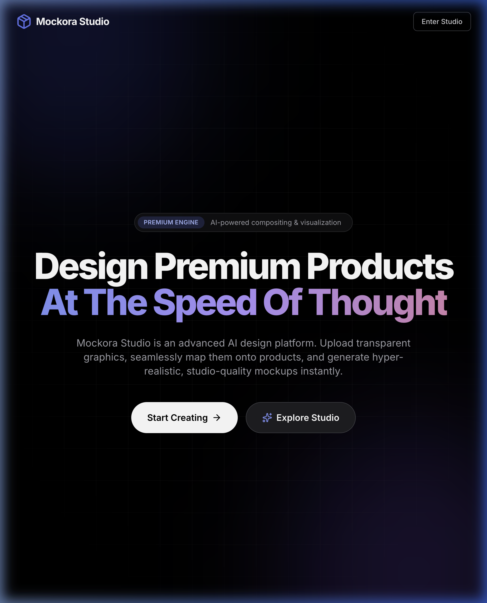
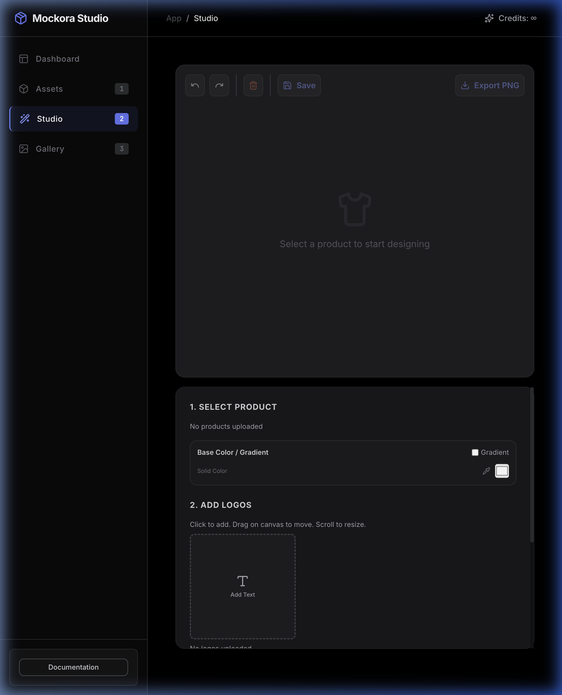

<div align="center">

<br />


<br /><br />

```text
 ███╗   ███╗ ██████╗  ██████╗██╗  ██╗ ██████╗ ██████╗  █████╗ 
 ████╗ ████║██╔═══██╗██╔════╝██║ ██╔╝██╔═══██╗██╔══██╗██╔══██╗
 ██╔████╔██║██║   ██║██║     █████╔╝ ██║   ██║██████╔╝███████║
 ██║╚██╔╝██║██║   ██║██║     ██╔═██╗ ██║   ██║██╔══██╗██╔══██║
 ██║ ╚═╝ ██║╚██████╔╝╚██████╗██║  ██╗╚██████╔╝██║  ██║██║  ██║
 ╚═╝     ╚═╝ ╚═════╝  ╚═════╝╚═╝  ╚═╝ ╚═════╝ ╚═╝  ╚═╝╚═╝  ╚═╝
```

### **Mockora Studio** — Premium Mockups. Blazing Fast. Yapay zeka ile stüdyo kalitesinde mockup'lar oluşturun.

**Gerçekçi Ürün Görselleştirme** · Katman Snapping · Matematiksel Pivot Dönüşümü · Tek bakışta profesyonel sonuç.

[🚀 Canlı Demo](https://mockora-studio.vercel.app) · [⚡ Gemini API](https://ai.google.dev/) · [☁️ Vercel](https://vercel.com)

</div>

---

## ✦ Genel Bakış

**Mockora Studio**, içerik üreticileri, e-ticaret satıcıları, print-on-demand markaları ve tasarımcılar için geliştirilmiş modern, premium bir **yapay zeka destekli mockup oluşturma platformudur**.

Photoshop'un ağır ve karmaşık şablonlarıyla uğraşmak yerine; şeffaf logolarınızı, yazılarınızı veya tasarımlarınızı tuval üzerinde sürükleyip yerleştirin, boyutlandırın ve döndürün. Gemini'nin güçlü görüntü üretme ve düzenleme modelleri sayesinde ürünün üzerine ışık, gölge, perspektif ve doku uyumuyla **tamamen gerçekçi** bir şekilde bindirilmiş nihai stüdyo fotoğraflarını saniyeler içinde elde edin.

> **Güvenli ve Bağımsız:** API anahtarınız local veya Vercel sunucusuz fonksiyonları aracılığıyla tamamen güvenli şekilde taşınır. Projeleriniz tarayıcınızın belleğinde (IndexedDB) saklanır, harici bir veritabanına ihtiyaç duymaz.

<div align="center">


</div>

---

## ⚡ Öne Çıkan Özellikler

| Özellik | Açıklama |
|--------|----------|
| 🤖 **Gemini AI Kompozisyonu** | Logolarınızı, dikiş, kıvrım, ışık ve gölgeleri analiz ederek ürüne kusursuzca yedirir. |
| 🎨 **Gelişmiş Stüdyo Tuvali** | Katman bazlı sürükle-bırak, matematiksel pivot merkezli döndürme ve hassas hizalama araçları. |
| 🗂️ **IndexedDB Veri Koruması** | Sayfa yenilense bile tüm yüklenen varlıkları (assets), geçmişi ve taslakları tarayıcıda saklar. |
| ↩️ **Tarihçe ve Z-Index** | Sınırsız geri alma/yineleme (undo/redo) ve katman sıralarını (z-index) kolayca değiştirme. |
| ✏️ **Özel Font Desteği** | Kendi `.ttf` / `.otf` fontlarınızı yükleyip doğrudan tuval üzerinde dinamik metin katmanları oluşturma. |
| 💾 **Proje İçe/Dışa Aktarma** | Tasarımlarınızı `.json` formatında bilgisayarınıza indirebilir, daha sonra kaldığınız yerden devam etmek için yükleyebilirsiniz. |
| ☁️ **Vercel Serverless Desteği** | API isteklerinin güvenliğini sağlamak ve API anahtarlarını client tarafına sızdırmamak için Node.js Serverless API yapısı. |

---

## 🛠️ Teknoloji Yığını

```
Frontend Editor →  React 19 · TypeScript · Vite · Tailwind CSS · Framer Motion
UI / Tasarım    →  Karanlık Lüks (Glassmorphism), Lucide Icons, html-to-image
Sunucusuz API   →  Vercel Serverless Functions (@vercel/node)
AI Entegrasyonu →  Google Gemini API (@google/genai SDK - gemini-3-pro-image-preview)
Yerel Depolama  →  IndexedDB (idb-keyval ile optimize edilmiş yerel veritabanı)
```

---

## 🔄 Nasıl Çalışıyor? (Veri Akışı)

```
                                          ┌──────────────┐
                                          │  Tarayıcı    │
                                          │  IndexedDB   │ (Yerel Proje Taslakları)
                                          └──────┬───────┘
                                                 │
  ┌──────────────┐      POST /api/generate       │      ┌────────────────────────┐
  │   Kullanıcı  │ ────────────────────────────▶ ┼───▶  │ Vercel Serverless API  │
  │   (Tasarım)  │ ◀────────────────────────────       │ (Node.js Handler)      │
  └──────────────┘         base64 PNG Sonucu            └───────────┬────────────┘
                                                                    │
                                                                    ▼
                                                        ┌────────────────────────┐
                                                        │       Gemini AI        │
                                                        │ (Image Generation SDK) │
                                                        └────────────────────────┘
```

1. Kullanıcı base ürünü ve logoları tarayıcıda bir araya getirip yerleşimi ayarlar.
2. Vercel Serverless Functions (`/api/*`) katman verilerini, koordinat ipuçlarını ve prompts parametrelerini alır.
3. Arka planda güvenli `GEMINI_API_KEY` kullanılarak Gemini Image Generation motoru çağrılır.
4. Çıkan hiper-gerçekçi mockup görseli anında tarayıcıya base64 formatında geri döner ve Galeriye eklenir.

---

## 📐 Proje Yapısı

```
MockoraStudio/
├── api/                       # Vercel Serverless Functions
│   ├── generate-mockup.ts     # Ürün üstüne logo giydirme API'si
│   ├── generate-asset.ts      # Prompt ile yeni logo/ürün üretme API'si
│   └── generate-realtime-composite.ts # AR görünümlerini fotorealistik fotoğraflara çevirme API'si
├── src/
│   ├── app/
│   ├── components/            # Button.tsx · FileUploader.tsx · ApiKeyDialog.tsx
│   ├── hooks/                 # useApiKey.ts (API anahtarı yönetimi)
│   ├── services/              # geminiService.ts (API çağrıları)
│   ├── App.tsx                # Ana Uygulama Arayüzü & Workflow Yönetimi
│   ├── index.css              # Global CSS, Font Tanımları ve Animasyonlar
│   ├── index.tsx              # React Uygulama Girişi
│   └── types.ts               # Ortak TypeScript Tipleri
├── docs/                      # Dokümanlar ve Ekran Görüntüleri
│   └── screenshots/           # landing.png · studio.png
├── vercel.json                # Vercel SPA ve Serverless Yönlendirme Konfigürasyonu
└── vite.config.ts             # Vite Yapılandırması
```

---

## 🚀 Kurulum ve Çalıştırma

### Gereksinimler
- Node.js `>= 18`
- Gemini API Anahtarı ([Google AI Studio](https://aistudio.google.com/))

### Adımlar

```bash
# Projeyi bilgisayarınıza klonlayın
git clone https://github.com/kutluhangil/MockoraStudio.git
cd MockoraStudio

# Bağımlılıkları yükleyin
npm install

# Yerel geliştirme sunucusunu başlatın
npm run dev
```

Uygulama yerel olarak `http://localhost:3000` adresinde çalışacaktır. API çağrılarının yerel ortamda da çalışması için kök dizine bir `.env` dosyası oluşturup içerisine API anahtarınızı ekleyebilirsiniz:

```env
GEMINI_API_KEY=AIzaSy...
```

---

## 🔒 Güvenlik & Gizlilik

- **Bring Your Own Key (BYOK):** Kendi API anahtarınızı uygulamanın arayüzünden ekleyerek tamamen ücretsiz kullanabilirsiniz. API anahtarlarınız asla uzak sunucularımıza kaydedilmez, sadece tarayıcınızın yerel hafızasında saklanır.
- **Yerel İşleme:** Görselleriniz harici bir veritabanına yüklenmez. Tüm veri akışı tarayıcınız ve Google Gemini API'leri arasında uçtan uca gerçekleşir.

---

<div align="center">

Tasarımcılar ve içerik üreticileri için ❤️ ile yapıldı · **[kutluhangil](https://github.com/kutluhangil)**

<br />

*Faydalı bulduysanız bir ⭐ bırakmayı unutmayın.*

</div>
